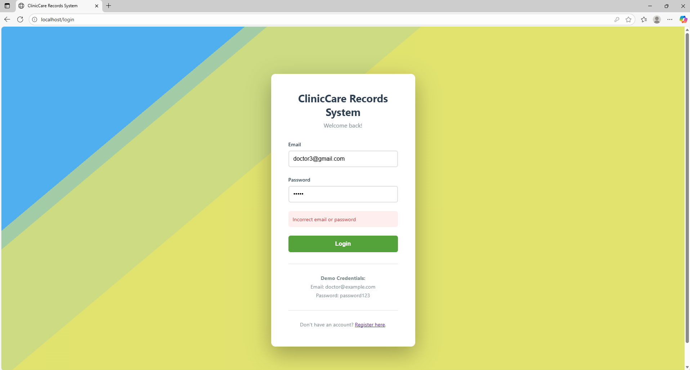
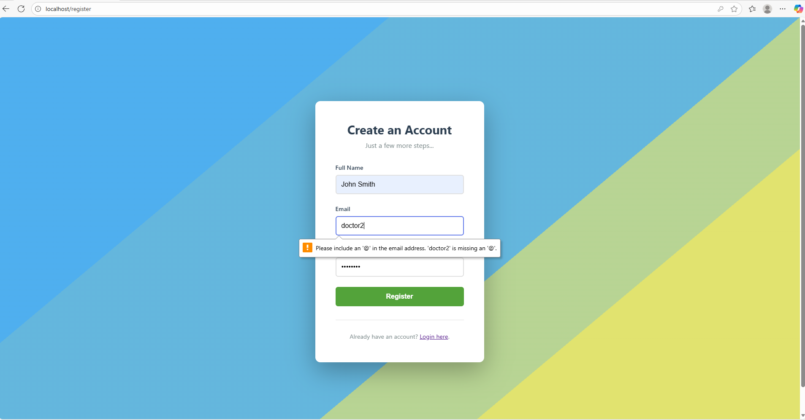

# ClinicCare Records System

### Capabilities

- Allows authenticated login of existing accounts and registration of new accounts, with consultation list tied to each account
- Stores past consultation notes and displays it in a list, persistent across logins (due to database)
- Accepts new consultation notes

See a short demonstration below.

[](https://youtu.be/fUeAqqO9jr0)

Here,

1. We log into John Enak's account to create a new consultation note and then log out
2. Register a new account and then log into that before logging out
3. Re-login to John Enak's account

As demonstrated, consultation lists are tied to each account.

More details below.

### Pre-Requisites

- Have Docker installed and running
- Have a web browser to see the frontend

### Project Setup

The project works without Docker. Nevertheless, to standardize setup for this project I decided to Dockerize the backend, the database, and the Vue frontend.

```bash
#assuming you are at the root of the project

# Build and start all services
docker-compose up --build

# if already built
docker-compose up

# to stop services
docker-compose down
```

The first command will:

1. Build the PostgreSQL database
2. Build the FastAPI backend
3. Build the Vue frontend
4. Start all three containers
5. Initialize the database with 100 ICD-10 codes and a doctor account

Then, the Web application is interactable at

```
http://localhost
```

Where it will promptly redirect you to `/login` if you aren't logged in, and `/consultations` if you are.

Note that I turned on volumes, so that data would persist across runs just like the usual databases.

If you wish to stop and remove all data, run the following command:

```bash
# to stop services and remove all volumes
docker-compose down -v
```

In reality, the best practice is to keep env secrets on local, but to facilitate the evaluation of this project I have shared it here (since it is credentials in a containerized app).

To interact with the database in the Dockerized application using psql, run the following command:

```bash
docker exec -it clinic_db psql -U postgres -d clinic_db
```

## Backend

The backend implements FastAPI using input validation with Pydantic. SQLAlchemy is used specifically for communicating with the database (enables switching of database types, if necessary, as SQLAlchemy is not tied to the language of the backend). Authentication uses JWT.

### All Available FastAPI Endpoints

All of this is also accessible at `http://localhost:8000/` in your local web browser.

See `http://localhost:8000/docs` for fastAPI documentation and schema requirements, and also if you want to test it out. Note that you need to get the JWT token from `/login` and put it in the `Authorize` button on the top right to try out the authenticated endpoints.

| Method | Endpoint                   | Auth Required | Description            |
| ------ | -------------------------- | ------------- | ---------------------- |
| GET    | `/`                        | No            | API info               |
| GET    | `/health`                  | No            | Health check           |
| POST   | `/auth/register`           | No            | Register new doctor    |
| POST   | `/auth/login`              | No            | Login and get token    |
| GET    | `/auth/me`                 | Yes           | Get current doctor     |
| GET    | `/diagnosis?search=<term>` | Yes           | Search diagnosis codes |
| POST   | `/consultation`            | Yes           | Create consultation    |
| GET    | `/consultation`            | Yes           | List consultations     |

### Pydantic Validation

Each schema defines field constraints, type safety, and custom validators to ensure consistent and secure API behavior. They come each with relevant error messages e.g. giving a password that doesn't contain a digit would throw a `ValueError` `Password must contain at least one digit`.

#### 1. Authentication Schemas

#### `DoctorCreate`

Handles user registration validation.

**Fields:**

- `email`: Must be a valid email address (`EmailStr`).
- `full_name`: 2–255 characters, cannot be empty or whitespace.
- `password`: 8–72 characters, must contain **at least one letter** and **one digit**.

**Custom Validators:**

- `password_strength`: Ensures password complexity (letters and digits required).
- `name_must_not_be_empty`: Strips whitespace and rejects empty names.

#### `Doctor`

Returned after registration or login.

- Includes `id`, `is_active`, and `created_at`.
- Uses `ConfigDict(from_attributes=True)` for ORM compatibility.

#### `LoginRequest`

Used for login requests.

- `email`: Must be a valid email.
- `password`: Required, non-empty string.

#### `Token` / `TokenData`

- `Token`: Represents JWT tokens returned after successful authentication.
- `TokenData`: Holds token payload data (e.g., user email).

---

#### 2. Diagnosis Schemas

#### `DiagnosisCodeBase`

- `code`: ICD-10 code, 2–10 characters.
- `description`: Diagnosis text, up to 500 characters.

#### `DiagnosisCode`

Extends `DiagnosisCodeBase` with:

- `id`
- ORM support via `ConfigDict(from_attributes=True)`

---

#### 3. Consultation Schemas

#### `ConsultationCreate`

Used for creating a new consultation.

**Fields:**

- `patient_name`: 2–255 characters, cannot be blank.
- `consultation_date`: Must not be a future date.
- `notes`: Optional, up to 5000 characters.
- `diagnosis_codes`: List of 1–20 ICD-10 codes.

**Custom Validators:**

- `name_must_not_be_empty`: Ensures non-empty, trimmed patient names.
- `date_not_future`: Rejects consultation dates after today.
- `codes_must_be_valid_format`:

  - Ensures all codes are non-empty and between 2–10 characters.
  - Automatically normalizes codes to uppercase.
  - Removes duplicates while preserving order.

#### `ConsultationResponse`

Returned on successful retrieval or creation of consultations.

- Includes `id`, `patient_name`, `consultation_date`, `notes`, `doctor_name`, and `diagnoses`.
- Uses ORM compatibility via `ConfigDict(from_attributes=True)`.

## Database

I decided to use PotgreSQL because it scales better. The database consists of 4 tables:

- `doctors`, used to store doctor accounts
- `diagnosis_codes`, diagnosis codes and their descriptions
- `consultations`, tracks consultations, contains patient name, date, notes,and which doctor saw them
- `consultation_diagnoses`, junction table to connect consultations to their respective diagnoses

This is structured to allow future queries such as "all consultations with diagnosis A00" to be easy. We can also add and remove diagnoses without string manipulation, and can get statistics e.g. on the most common diagnoses.

Say, for example, patient John Doe visits on Nov 2, 2024, and was seen by Dr. Tan Lee. Then the main relevant parts (`doctor`, `diagnoses` table and creation times omitted for simplicity) are as following:

`consultations` table:
| id | doctor_id | patient_name | consultation_date | notes |
|----|-----------|--------------|-------------------|--------------------|
| 1 | 1 (links to Dr. Tan Lee on `doctor` table) | John Doe | 2024-11-02 | Fever and nausea |

`consultation_diagnoses` table:
| id | consultation_id | diagnosis_code_id |
|----|-----------------|-------------------|
| 1 | 1 | 5 (links to A00 - Cholera) |
| 2 | 1 | 6 (links to A01 - Typhoid) |

## Frontend

I used Vue with scoped style CSS as standard for Vue development.

### Key Features

- Single Page Application (SPA): The app loads once via index.html, and navigation between routes happens dynamically using Vue Router, without full page reloads
- Authentication state and user info are handled client-side via a composable (useAuth.js)
- All requests to the backend are handled via Axios
- The router checks for authentication before allowing access to secured pages like `/consultation`. Unauthenticated users are redirected to `/login`

### UI Design

The UI inside the app is designed to be clean and not-confusing for doctors, especially senior ones that may be less familiar with technology. That is why no colorful backgrounds or animations are implemented inside, and the `New Consultation` button is both on the navbar and the past consultations list.

The navigation bar and background animations are reactive based on the user’s authentication state.

When logged in, it shows the doctor’s name and logout options in the navbar. When logged out, the app displays animated backgrounds for `/login` and `/register`.

### JWT Authentication

The JWT token is provided when the doctor logs in; it is only cleared when the doctor logs out. This means that if the doctor closes the web application by accident, they could return to the application and not have to redo the login due to the token. This is how most web applications I've seen do it to reduce the amount of logins the end user needs to do.

### Communicating Errors

The frontend will notify users of errors in their field inputs by leveraging Pydantic and basic error checking. Some examples are attached below.

When the login account details are wrong:


When the email provided for registration is invalid:

